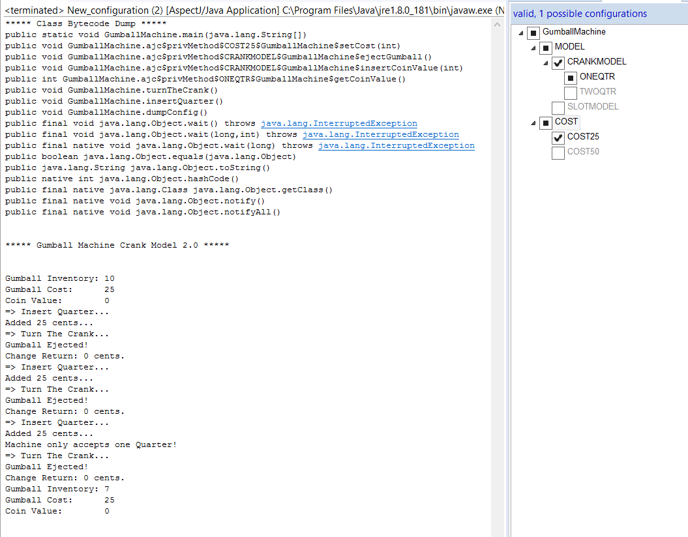
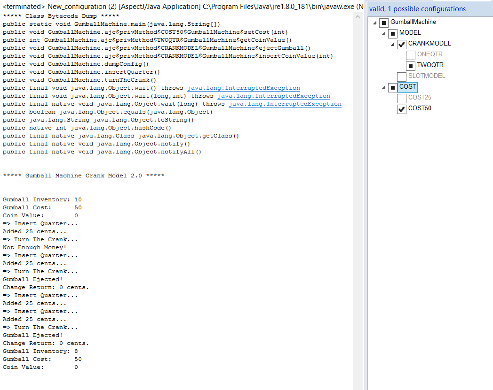
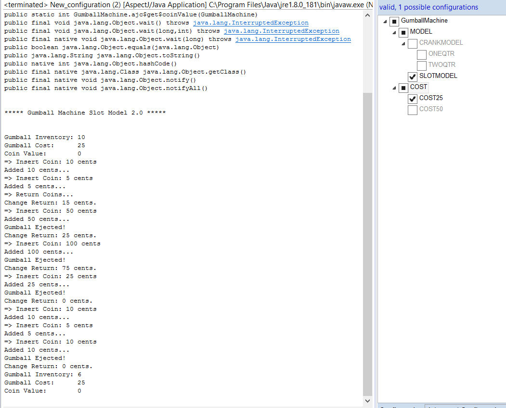
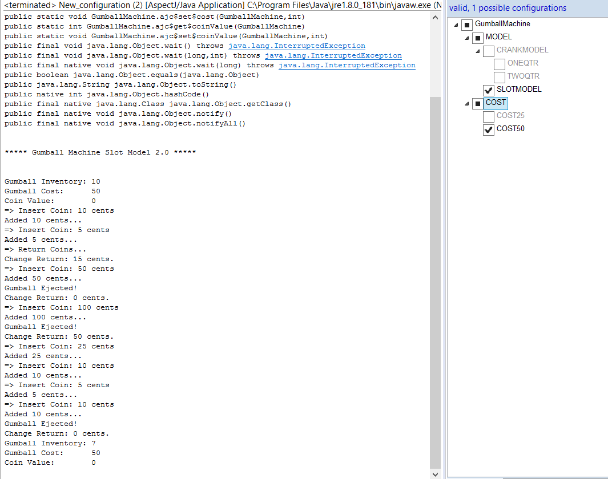

## Submission for CMPE202 Lab 10

### Summary

- In Lab1 we created different classes for different type of gumball machines. So changing the configurations would mean a lot of changes in code. In FeatureIDE AspectJ, the configuration of GumballMahcine is in a config file. Configurations can be changed easily to achieve the desired output. Using AOP we can make handling of variations and future requirement easily managable by just adding the features as and when they change. Use of AspectJ reduced the amount of code required to implement Gumball Machine.

### Lab 10 Screenshots-

- Configurations and outputs:

i. Model: CRANK , COST: 25

ii. Model: CRANK , COST: 50

iii. Model: SLOT , COST: 25

iv. Model: SLOT , COST: 50

